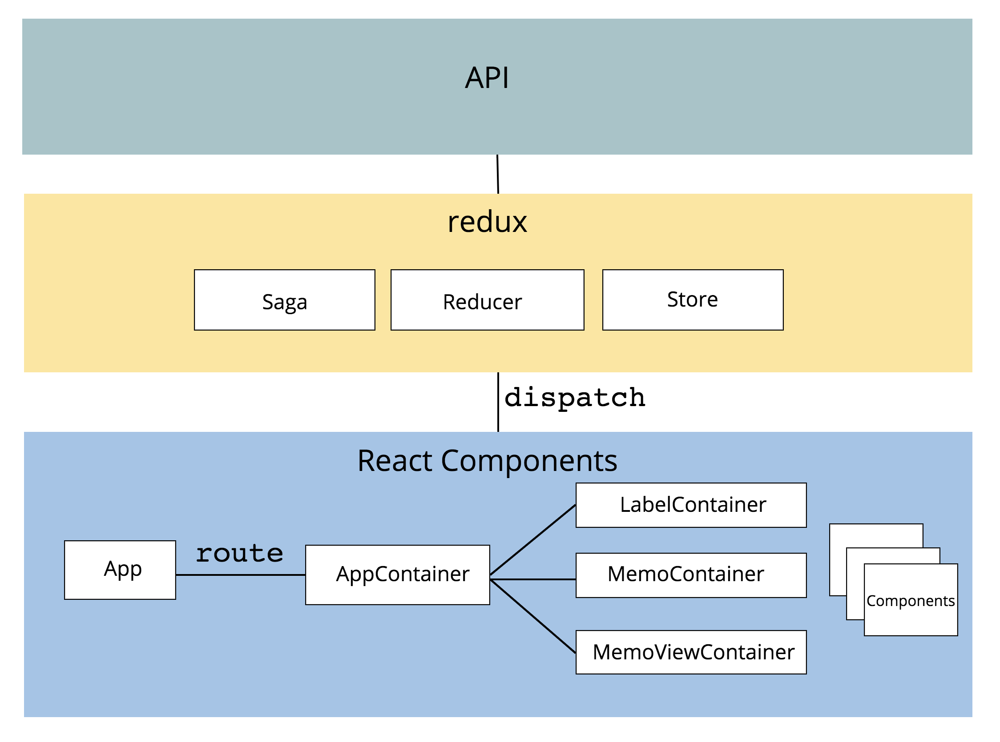

# react memo

## 설정하기

- [node.js](nodejs.org) v8.x 이상의 버전 설치
- [mongodb](https://www.mongodb.com/) 설치

## Architecture

## 사용한 주요 프레임워크 및 라이브러리

### Client

- [create-react-app](https://github.com/facebookincubator/create-react-app/blob/master/packages/react-scripts/template/README.md)
- [react](https://reactjs.org/)
- [react-router](https://github.com/ReactTraining/react-router)
- [redux](https://github.com/reactjs/redux)
- [redux-saga](https://github.com/redux-saga/redux-saga)
- [axios](https://github.com/axios/axios)
- [storybook](https://github.com/storybooks/storybook)

### Server

- [node.js](nodejs.org)
- [express](http://expressjs.com/ko/)
- [mongodb](http://mongoosejs.com/)
- [mongoose](https://www.mongodb.com/)
- [typescript](https://www.typescriptlang.org/)

### 실핼하기

`Client`와 `Server`가 분리된 프로젝트이므로 둘 다 띄워야합니다.

#### Server 실행하기

1. `server` 폴더로 이동
2. `npm install` 실행
3. `.env` 파일을 열어 mongodb url 설정(설치 후 mongodb의 기본 포트값을 바꾸지 않았다면 고치지 않아도 됨)
4. `npm run start` 실행

#### Client 실행하기

1. `client` 폴더로 이동
2. `npm install` 실행
3. `npm run start` 실행

## Front-end architecture

## Server API

|api|method|설명|
|---|-------|----|
|/api/labels|GET|Label 목록을 조회한다.|
|/api/labels|POST|Label을 생성한다. `request body`로 `{ name: 'Label 이름' }` 을 받는다.|
|/api/labels/:labelId|PUT|labelId의 Label을 수정한다.|
|/api/labels/:labelId|DELETE|labelId에 해당하는 Label을 삭제한다.|
|/api/memos|GET|Memo를 조회한다. `labelId`를 querystring으로 받는 경우, 해당 label에 속한 Memo만 조회한다.
|/api/memos/count|GET|Memo의 갯수를 조회한다. `labelId`를 querystring으로 받는 경우, 해당 label에 속한 Memo의 갯수만 조회한다.|
|/api/memos|POST|Memo를 생성한다. `request body`로 `{ title: '타이틀', content: '내용'}` 을 받는다.|
|/api/memos/:memoId|PUT|`memoId`에 해당하는 Memo를 수정한다. `request body`로 `{ title: '타이틀', content: '내용'}` 을 받는다.|
|/api/memos|PUT| `request body`로 `{ labelIds: [labelId], memoIds: [memoId] }` 을 받는다. `memoIds` 배열에 속한 모든 memo에 labelIds에 들은 label을 설정한다.|
|/api/memos/:memoId|DELETE|`memoId`에 해당하는 Memo를 삭제한다.|

### 개선이 필요한 사항

#### Front-end

- 일부 동작은 local storage 연동하여 로컬 캐싱하도록 수정
- Progressive Web Application 적용
- 모바일 디바이스 일 때 반응형 강화
- 메모 조회 시 정렬 필터 붙이기
- 메모에 Label을 매핑하는 부분의 화면 디자인 및 UX 개선
  - 메모 단건에 Label을 매핑할 때와 메모 여러건에 Label을 매핑할 때의 UX를 다르게 가져가기 
- 라벨 순서 지정 기능
- Unit Test 작성
- e2e Test 작성
- 
#### Back-end
- `Label`의 `memoCount`를 현재는 `count()` 함수로 맞추고 있는데 이 부분을 직접 가감하는 방식으로 개선하기
- 가끔 `Label`의 `memoCount` 업데이트가 제대로 안 되는 때가 있음. async ~ await 어딘가의 버그인지 API 코드를 점검해야 함.
- API 코드가 index.js에 모두 모여있으므로 리팩토링이 필요함.
- Unit Test 작성
- 퍼포먼스 테스트